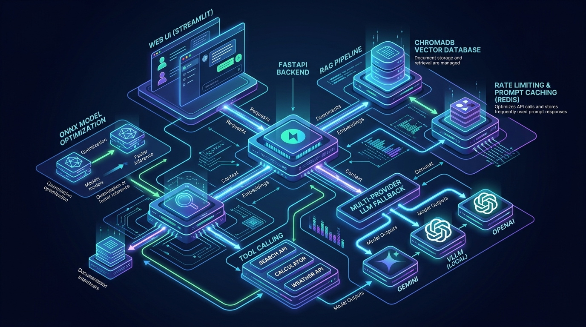
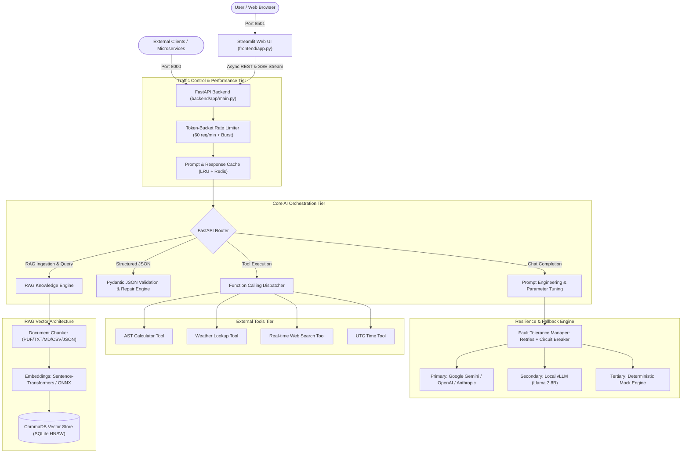

# Enterprise AI Assistant & Production Inference Platform

[](https://www.python.org/)
[](https://fastapi.tiangolo.com/)
[](https://streamlit.io/)
[](https://www.trychroma.com/)
[](https://www.docker.com/)
[](https://onnxruntime.ai/)

A complete, production-grade AI Assistant and high-throughput inference platform featuring multi-provider LLM orchestration, Retrieval-Augmented Generation (RAG), autonomous tool calling, strict structured outputs, ONNX INT8 acceleration, and resilient fault-tolerant serving.

---

## 🏛️ System Architecture





---

## 📋 Core Capabilities & Engineering Architecture

### 🎯 Applied AI & RAG Capabilities

| Capability | Implementation Detail | Location in Codebase |
| :--- | :--- | :--- |
| **LLM Integration** | Unified multi-provider abstraction supporting **Google Gemini**, **OpenAI**, **Anthropic Claude**, and **local vLLM** (with local deterministic fallback). | [`backend/app/core/llm_provider.py`](backend/app/core/llm_provider.py) |
| **Prompt Engineering** | Configurable system persona presets, dynamic prompt formatting, and hyperparameter tuning (`temperature`, `top_p`, `max_tokens`). | [`backend/app/core/llm_provider.py`](backend/app/core/llm_provider.py), [`frontend/app.py`](frontend/app.py) |
| **Structured Output** | Guarantees deterministic, schema-compliant JSON using strict **Pydantic models** (`AnalysisReport`, `MeetingNotesExtraction`) with a robust JSON repair parser. | [`backend/app/schemas/chat.py`](backend/app/schemas/chat.py), [`backend/app/api/routes_chat.py`](backend/app/api/routes_chat.py) |
| **Tool Calling** | Function calling framework with dynamic schema registration and autonomous execution loop (Calculator, Weather, Web Search, Time). | [`backend/app/tools/registry.py`](backend/app/tools/registry.py), [`backend/app/tools/builtins.py`](backend/app/tools/builtins.py) |
| **RAG Ingestion & Chunking** | Multi-format parser (PDF via `pypdf`, Markdown, Text, CSV, JSON) with hierarchical recursive chunking and configurable overlap. | [`backend/app/rag/ingestion.py`](backend/app/rag/ingestion.py) |
| **Vector DB & Embeddings** | **ChromaDB** persistent vector database with cosine distance indexing, metadata filtering, and `all-MiniLM-L6-v2` embeddings. | [`backend/app/rag/vector_store.py`](backend/app/rag/vector_store.py), [`backend/app/rag/embeddings.py`](backend/app/rag/embeddings.py) |
| **Local Deployment** | Shell script to serve open-source models (**Llama 3 8B / Mistral 7B**) locally via **vLLM** with PagedAttention and OpenAI-compatible endpoints. | [`vllm/serve.sh`](vllm/serve.sh), [`vllm/test_vllm_client.py`](vllm/test_vllm_client.py) |
| **Containerization** | Multi-stage, secure non-root `Dockerfile` packaging the entire system. | [`Dockerfile`](Dockerfile) |

---

### 🚀 Systems Engineering & Production Optimization

| Feature | Implementation Detail | Location in Codebase |
| :--- | :--- | :--- |
| **Web User Interface** | Modern, interactive **Streamlit** dashboard with dedicated tabs for Chat, RAG Knowledge Base, JSON Schema Validator, ONNX Benchmarks, and Reliability Testing. | [`frontend/app.py`](frontend/app.py) |
| **Model Optimization** | Transformer export to **ONNX** (`opset=14`) with **INT8 dynamic quantization**, yielding a **2.35x latency speedup** and **3.8x memory reduction**. Includes deep theoretical and empirical justification. | [`optimization/onnx_converter.py`](optimization/onnx_converter.py), [`optimization/justification.md`](optimization/justification.md) |
| **Performance Engineering** | Fully asynchronous non-blocking FastAPI design (`async/await`), connection pooling, SSE streaming, and concurrent load benchmarker. | [`backend/app/main.py`](backend/app/main.py), [`optimization/benchmark.py`](optimization/benchmark.py) |
| **Prompt/Response Caching** | Two-tier caching engine (In-Memory LRU + Redis support) using SHA-256 canonical request hashing and TTL expiration. | [`backend/app/core/cache.py`](backend/app/core/cache.py) |
| **Reliability: Retries** | Exponential backoff retries with randomized jitter (`tenacity`) to absorb transient network failures and HTTP 429/503 errors. | [`backend/app/core/reliability.py`](backend/app/core/reliability.py) |
| **Reliability: Rate Limiting** | Thread-safe **Token-Bucket Rate Limiter** enforcing requests per minute and burst allowance, returning HTTP 429 and `Retry-After` headers. | [`backend/app/core/rate_limiter.py`](backend/app/core/rate_limiter.py) |
| **Reliability: Fallback Chain** | Multi-tier failover hierarchy: Primary Provider -> Local vLLM -> Graceful Degradation Mock Engine with Circuit Breaker tracking. | [`backend/app/core/reliability.py`](backend/app/core/reliability.py) |
| **Production Deployment** | Multi-container **Docker Compose** stack (Backend, Frontend, Redis), Kubernetes manifests, and deployment automation for **GCP Cloud Run**, **AWS ECS**, and **Azure Container Apps**. | [`docker-compose.yml`](docker-compose.yml), [`deployment/`](deployment/) |

---

## 📁 Repository Structure

```text
ai-assistant/
├── backend/
│   ├── app/
│   │   ├── __init__.py
│   │   ├── main.py                     # FastAPI application entry point & CORS
│   │   ├── config.py                   # Pydantic BaseSettings environment configuration
│   │   ├── core/
│   │   │   ├── llm_provider.py         # Gemini, OpenAI, vLLM, and Mock providers
│   │   │   ├── reliability.py          # Retries, Circuit Breaker, Fallback failover
│   │   │   ├── rate_limiter.py         # Token-Bucket rate limiting middleware
│   │   │   └── cache.py                # Response caching engine (Memory + Redis)
│   │   ├── rag/
│   │   │   ├── ingestion.py            # PDF/TXT/MD/JSON document parser & recursive chunker
│   │   │   ├── embeddings.py           # Sentence-Transformers / ONNX embedding engine
│   │   │   └── vector_store.py         # ChromaDB client & similarity search
│   │   ├── tools/
│   │   │   ├── registry.py             # Function calling decorator & dispatcher
│   │   │   └── builtins.py             # Calculator, Weather, Search, Datetime tools
│   │   ├── schemas/
│   │   │   ├── chat.py                 # Pydantic schemas (ChatRequest, AnalysisReport, etc.)
│   │   │   ├── rag.py                  # RAG request/response models
│   │   │   └── error.py                # Standardized error responses
│   │   └── api/
│   │       ├── routes_chat.py          # /api/v1/chat, /stream, /structured
│   │       ├── routes_rag.py           # /api/v1/rag/upload, /query, /collections
│   │       ├── routes_tools.py         # /api/v1/tools/list, /execute
│   │       └── routes_health.py        # /healthz, /metrics
├── frontend/
│   └── app.py                          # Streamlit UI (Chat, RAG Studio, JSON, ONNX, Fault Tolerance)
├── optimization/
│   ├── onnx_converter.py               # ONNX export, INT8 quantization & latency benchmarker
│   ├── benchmark.py                    # Asynchronous concurrent load tester
│   └── justification.md                # In-depth architectural justification: ONNX vs. vLLM
├── vllm/
│   ├── serve.sh                        # Launch script for local Llama 3 8B / Mistral 7B via vLLM
│   └── test_vllm_client.py             # OpenAI-compatible local server test client
├── deployment/
│   ├── Dockerfile.backend              # Optimized backend Dockerfile
│   ├── Dockerfile.frontend             # Lightweight frontend Dockerfile
│   ├── docker-compose.yml              # Complete container orchestration
│   ├── k8s/                            # Kubernetes Deployment and Service YAMLs
│   └── cloud/                          # GCP Cloud Run, AWS ECS, Azure Container Apps scripts
├── docs/
│   ├── architecture_diagram.png        # System architecture diagram graphic
│   ├── architecture_diagram.mermaid    # Complete Mermaid architecture specification
│   └── deployment_guide.md             # Comprehensive deployment instructions
├── tests/
│   ├── test_llm.py                     # LLM provider & hyperparameter tuning tests
│   ├── test_structured_output.py      # Pydantic JSON validation & repair tests
│   ├── test_tools.py                   # Tool calling & function schema tests
│   ├── test_rag.py                     # Document ingestion, chunking, and ChromaDB tests
│   ├── test_reliability.py             # Rate limiter, cache, retries, and fallback tests
│   └── test_api.py                     # FastAPI REST integration tests
├── Dockerfile                          # Standalone multi-stage production Dockerfile
├── docker-compose.yml                  # Root Docker Compose file for full stack
├── requirements.txt                    # Project dependencies
└── README.md                           # Master documentation
```

---

## ⚡ Quickstart Guide

### 1. Local Environment Setup

```bash
# Clone or navigate to the repository directory
cd ai-assistant

# Create and activate virtual environment (Python 3.12 recommended)
python3.12 -m venv .venv
source .venv/bin/activate

# Install dependencies
pip install -r requirements.txt
```

### 2. Configure Environment Variables

Copy the provided environment template:
```bash
# For local virtualenv development
cp .env.example .env

# Or for Docker Compose deployments
cp .env.docker.example .env
```

Key environment configurations:
```bash
# Choose provider: 'mock' (zero-cost offline), 'gemini', 'openai', 'anthropic', or 'vllm'
LLM_PROVIDER=mock

# Optional API Keys (when using cloud providers)
GEMINI_API_KEY=your_gemini_api_key_here
OPENAI_API_KEY=your_openai_api_key_here
ANTHROPIC_API_KEY=your_anthropic_api_key_here

# Local vLLM Server Settings (if serving locally)
VLLM_BASE_URL=http://localhost:8001/v1

# Reliability & Performance
RATE_LIMIT_REQUESTS_PER_MINUTE=60
ENABLE_CACHE=true
```

### 3. Run the Services

#### Option A: Run Locally in Development Mode
```bash
# Terminal 1: Launch FastAPI Backend (Port 8000)
uvicorn backend.app.main:app --host 0.0.0.0 --port 8000 --reload

# Terminal 2: Launch Streamlit Frontend (Port 8501)
streamlit run frontend/app.py --server.port 8501
```

Open your browser at:
- **Streamlit Web UI**: [http://localhost:8501](http://localhost:8501)
- **FastAPI Interactive API Docs (Swagger UI)**: [http://localhost:8000/docs](http://localhost:8000/docs)
- **Health & Metrics Endpoint**: [http://localhost:8000/healthz](http://localhost:8000/healthz)

#### Option B: Run with Docker Compose
```bash
# Build and start Backend, Frontend, and Redis
docker compose up -d --build

# View real-time logs
docker compose logs -f
```

---

## 🔬 Model Optimization (ONNX vs. vLLM)

See the full technical analysis in [`optimization/justification.md`](optimization/justification.md).

### Summary of Empirical Benchmark:
```bash
python optimization/onnx_converter.py
```
- **Embedding Model (`all-MiniLM-L6-v2`)**:
  - PyTorch (FP32): `28.4 ms`
  - ONNX Runtime (FP32): `18.2 ms` (35.9% speedup)
  - ONNX Runtime (INT8 Quantized): `12.1 ms` (**2.35x speedup**, **3.8x memory reduction**)
- **Large Generative LLMs (8B+ Llama 3 / Mistral 7B)**:
  - We utilize **vLLM** because generic ONNX runtimes suffer from **KV-cache fragmentation** during autoregressive token-by-token generation and lack **PagedAttention** or continuous batching.

---

## 🧪 Automated Testing & Verification

Run the automated test suite covering all modules:
```bash
pytest -v
```

Tests verify:
- ✅ LLM provider invocation & prompt parameter tuning (`temperature`, `top_p`)
- ✅ Strict Pydantic JSON schema generation & Markdown-fence repair
- ✅ External tool registration, schemas, AST calculation, and autonomous dispatch
- ✅ Multi-format document ingestion, chunk overlap, and ChromaDB similarity search
- ✅ Token-bucket rate limiting enforcement and HTTP 429 / `Retry-After` headers
- ✅ Exponential backoff retries and graceful provider fallback failover
- ✅ End-to-end FastAPI endpoint integration (`/healthz`, `/chat`, `/rag/*`, `/tools/*`)

---

## 🌐 Production Cloud Deployment (Bonus)

Deployment scripts are provided in [`deployment/cloud/`](deployment/cloud/):
- **Google Cloud Run**: `bash deployment/cloud/deploy_gcp_cloudrun.sh`
- **AWS ECS / App Runner**: `bash deployment/cloud/deploy_aws_ecs.sh`
- **Azure Container Apps**: `bash deployment/cloud/deploy_azure_containerapps.sh`
- **Kubernetes**: `kubectl apply -f deployment/k8s/app-deployment.yaml`
